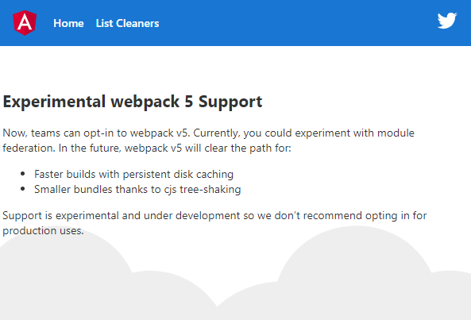

# Example for @angular-architects/module-federation

This examples loads a microfrontend into a shell:

## Important Files

Have a particular look at the following files:

- `readme.md`: Shows how to install dependencies and how to start the example
- `projects\cleaners\webpack.config.js`: Microfrontend config
- `projects\app-shell\webpack.config.js`: Shell config
- `projects\app-shell\src\app\app.routes.ts`: Lazy route for microfrontend
- `projects\shell\src\decl.d.ts`: Typing for mapped Url pointing to microfrontend

## Installation and Usage

- Install packages: `yarn` (!)\*
- Start Micro Frontend (remote): `ng serve cleaners -o`
- Start Shell (host): `ng serve app-shell -o`
- Make sure `cleaners` is started before `app-shell` is loaded into the browser
- Note: (This is important because the app-shell does an initial call to the cleaners MicroFrontend during the app-shell bootstrap)
- Use the hyperlink `List Cleaners` in the `app-shell` to load `cleaners`

\* Please note, you **must** use **yarn** during the beta phase of CLI 11 b/c it allows to override dependencies to force the CLI into webpack 5.

## More Details on Module Federation from Manfred Steyer

Have a look at this [article series about Module Federation](https://www.angulararchitects.io/aktuelles/the-microfrontend-revolution-part-2-module-federation-with-angular/)

## Angular Trainings, Workshops, and Consulting

- [Angular Trainings and Workshops](https://www.angulararchitects.io/en/angular-workshops/)
- [Angular Consulting](https://www.angulararchitects.io/en/consulting/)
